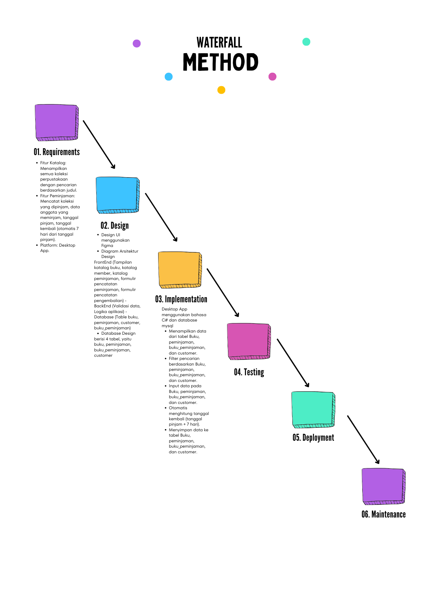
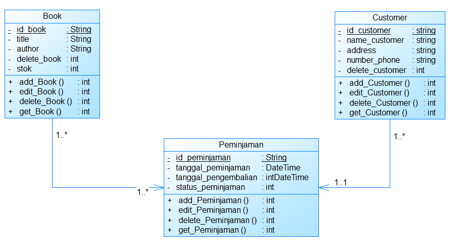
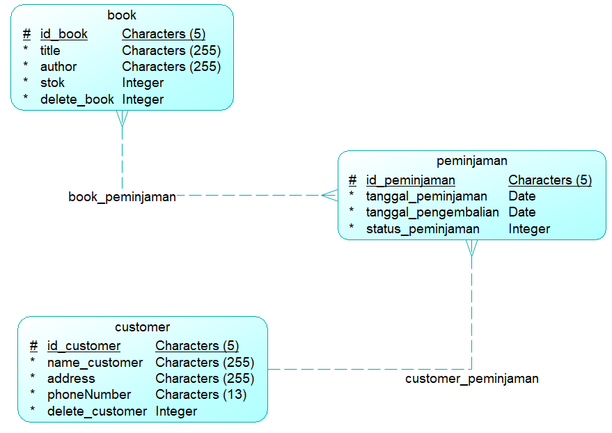

# Perangkat Lunak Manajemen Perpustakaan

## Gambaran Umum
Proyek ini adalah perangkat lunak manajemen perpustakaan yang dirancang untuk mempermudah operasional perpustakaan. Aplikasi ini dirancang dalam versi desktop dan menyediakan fitur penting untuk pencatatan peminjaman. Perangkat lunak ini dikembangkan menggunakan *Metode Waterfall* untuk memastikan proses pengembangan yang terstruktur dan sistematis.

## Fitur
### 1. *Katalog untuk Anggota*
   - Menampilkan semua koleksi yang tersedia di perpustakaan.
   - Fungsi pencarian untuk membantu menemukan buku tertentu.

### 2. *Manajemen Peminjaman untuk Petugas*
   - Mencatat detail peminjaman, termasuk:
     - Koleksi yang dipinjam.
     - Informasi anggota.
     - Tanggal peminjaman.
     - Tanggal pengembalian (7 hari dari tanggal peminjaman).

## Metodologi Pengembangan

## Diagram Sistem
### 1. *Diagram Kelas*
   Diagram kelas menunjukkan struktur sistem, termasuk kelas, atribut, dan relasi.

   

### 2. *Model Data Konseptual (CDM)*
   CDM menggambarkan struktur tingkat tinggi dari basis data, menunjukkan entitas dan relasinya.

   

### 3. *Model Data Fisik (PDM)*
   PDM menyediakan implementasi detail dari basis data, termasuk tabel, kolom, dan tipe data.

   
